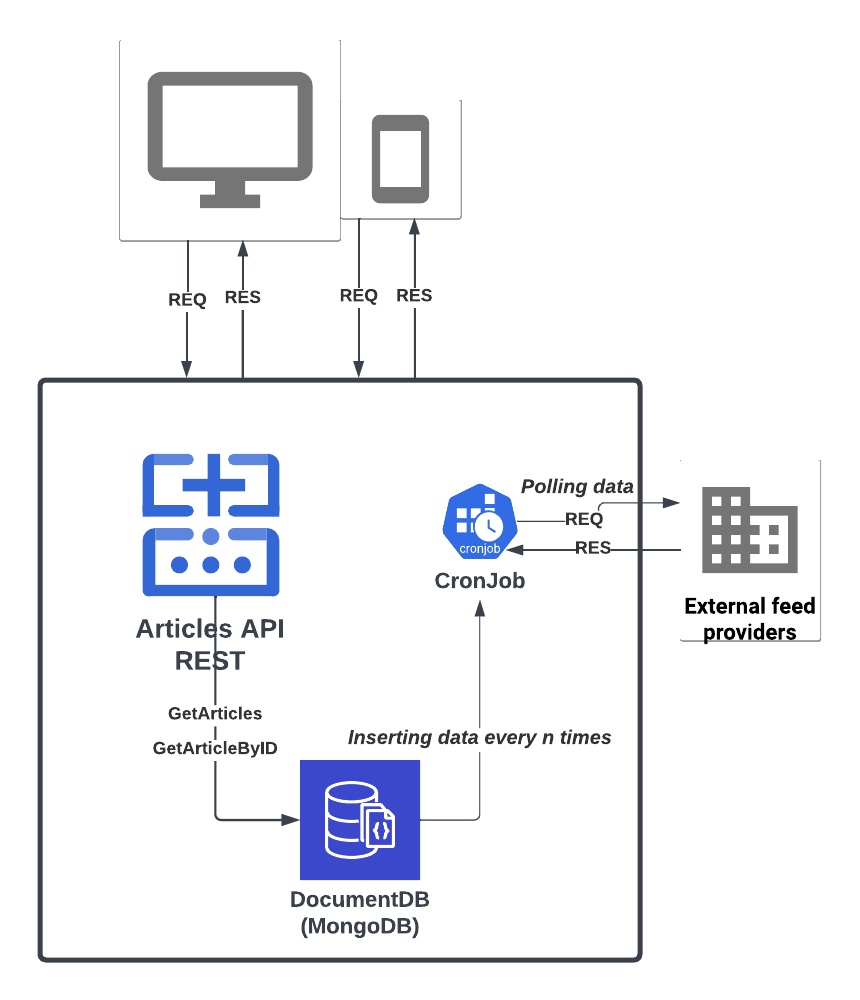

# Incrowd - Sports News

**We want to provide stability in new News by implementing cron-job calling external data feed and transforming data into consistent and desirable format that the app developers can consume, so that, as is often the case, when the external provider has issues we can still provide data to the apps, albeit stale data.**

To address this, I implemented a cronjob that runs every 5-minute, which periodically updates the data in our mongoDB. This approach balances the need for resource availability with the need to avoid overloading the provider feed API with too many requests. Instead, we want to strike a balance between freshness and efficiency, which is why we decided to use a 5-minute cron timer. As a general rule, it is recommended to limit the number of requests per minute to an external API to a reasonable number to avoid overloading the server or causing a denial of service (DoS) attack. Typically, most APIs have rate limiting policies in place to prevent excessive usage, and it is important to respect those limits to avoid getting banned or blocked. Since, I dont know the policies of data feed provider, I can't be more accurate in my decision.

The importance of this approach is illustrated by the hypothetical case of Leo Messi returning to FC Barcelona. If our cron job is set to run every 30 min or 2 hours, there is a possibility that the news about Messi's return might not appear in our database, which would impact badly in our traffic and customer experience, and we dont want that in incrowd. To avoid this, we need to periodically update our database with fresh data from the provider feed API.

Overall, I believe that the approach I took to the technical test strikes a balance between efficiency, freshness, and customer satisfaction, and will be effective in meeting the needs of business.
 
## Authors

- [@xavimg](https://github.com/xavimg)


## Run Locally

Clone the project

```bash
  git clone https://github.com/xavimg/articles.git
```
Run this Makefile command:

```bash
  make up_build
```
# REST API

The REST API to the example app is described below.

## Get list of Articles

### Request where t94 is param {team}

curl --location --request GET 'localhost:4007/teams/t94/news'

### Response

{"status":"succes","data":[{"id":"63fbfb4d26d4bc535d953e2e","teamId":"t94","articleURL":"https://www.wearehullcity.co.uk/news/2023/february/bristol-city-v-hull-city/","newsArticleID":"443768","publishDate":"2023-02-25T13:30:35Z","type":["Match Reports"],"teaserText":"Hull City’s winless run extended to four matches following a narrow defeat at improving Bristol City.","thumbnailImageURL":"https://www.wearehullcity.co.uk/api/image/feedassets/48bb5ab7-2c91-4201-97ab-1c70a4a0d766/Medium/g34-bristol-city-a-feb-2023-02.jpg","title":"Bristol City 1-0 Hull City","optaMatchID":"g2300117","lastUpdateDate":"2023-02-26T13:45:07Z","published":true},{"id":"63fbfb4d26d4bc535d953e2d","teamId":"t94","articleURL":"https://www.wearehullcity.co.uk/news/2023/february/roseniors-bristol-city-reaction/","newsArticleID":"443849","publishDate":"2023-02-25T21:23:37Z","type":["Interviews"],"teaserText":"Liam Rosenior felt a sluggish start set the tone for Hull City’s narrow 1-0 loss at Bristol City.","thumbnailImageURL":"https://www.wearehullcity.co.uk/api/image/feedassets/4739df60-379a-4fdd-bd92-23de9026785c/Medium/liam-rosenior-bristol-city-a-feb-2023.jpg","title":"Rosenior’s Bristol City Reaction","optaMatchID":"g2300117","lastUpdateDate":"2023-02-25T21:33:19Z","published":true},{"id":"63fbfb4d26d4bc535d953e2f","teamId":"t94","articleURL":"https://www.wearehullcity.co.uk/news/2023/february/team-news-bristol-city-a/","newsArticleID":"443767","publishDate":"2023-02-25T13:29:49Z","type":["Club News"],"teaserText":"January loan signings Karl Darlow and Malcolm Ebiowei have been handed their first starts in Hull City colours for the trip to in-form Bristol City.","thumbnailImageURL":"https://www.wearehullcity.co.uk/api/image/feedassets/a48940e0-d057-49e2-84ec-aff188f641d7/Medium/ashton-gate-feb-2023.jpg","title":"Team News: Bristol City (A)","optaMatchID":"g2300117","lastUpdateDate":"2023-02-25T14:07:05Z","published":true},{"id":"63fbfb4d26d4bc535d953e30","teamId":"t94","articleURL":"https://www.wearehullcity.co.uk/news/2023/february/put-your-thoughts-to-the-supporters-committee/","newsArticleID":"443426","publishDate":"2023-02-24T15:59:00Z","type":["Club News"],"teaserText":"Supporters have the chance to put their questions to this season's Supporters' Committee before the next meeting on Wednesday 26th April.","thumbnailImageURL":"https://www.wearehullcity.co.uk/api/image/feedassets/7be8ab68-89e5-4333-8a5b-9541f274c486/Medium/join-our-supporters-committee-1920x1080.jpg","title":"Put your thoughts to the Supporters' Committee","optaMatchID":"","lastUpdateDate":"2023-02-25T02:00:06Z","published":true},{"id":"63fbfb4d26d4bc535d953e33","teamId":"t94","articleURL":"https://www.wearehullcity.co.uk/news/2023/february/20-off-our-2223-away-shirt/","newsArticleID":"443669","publishDate":"2023-02-24T11:59:00Z","type":["Club News"],"teaserText":"Starting from Friday 24th February, there is a 20% discount on our 22/23 Away Kit, available online and in-store!","thumbnailImageURL":"https://www.wearehullcity.co.uk/api/image/feedassets/b6d79477-adad-42f5-bd21-cc59b05bdc99/Medium/away-sale-1920x1080-v2.jpg","title":"20% off our 2022/23 Away Kit!","optaMatchID":"","lastUpdateDate":"2023-02-25T02:00:06Z","published":true},{"id":"63fbfb4d26d4bc535d953e35","teamId":"t94","articleURL":"https://www.wearehullcity.co.uk/news/2023/february/no-pay-on-the-day-at-bristol/","newsArticleID":"443683","publishDate":"2023-02-24T10:29:56Z","type":["Ticket News"],"teaserText":"Tickets for Hull City’s Sky Bet Championship fixture away at Bristol City will not be made available at Ashton Gate - meaning supporters must have purchased tickets in advance to attend.","thumbnailImageURL":"https://www.wearehullcity.co.uk/api/image/feedassets/b50f9359-d3a8-4fbf-9757-a6a2e4309403/Medium/13_bristol-city-tickets-wide-1920x1080.jpg","title":"No pay on the day at Bristol","optaMatchID":"","lastUpdateDate":"2023-02-25T02:00:01Z","published":true},{"id":"63fbfb4d26d4bc535d953e31","teamId":"t94","articleURL":"https://www.wearehullcity.co.uk/news/2023/february/greg-docherty-pre-bristol-city-a-press-conference/","newsArticleID":"443718","publishDate":"2023-02-24T12:37:17Z","type":["Interviews"],"teaserText":"Greg Docherty spoke to the media ahead of the Tigers' trip to Ashton Gate.","thumbnailImageURL":"https://www.wearehullcity.co.uk/api/image/feedassets/9289cf43-86df-4c50-9b55-34f5bddd0339/Medium/press-greg-docherty-pre-bristol-city-a-feb-2023.jpg","title":"Greg Docherty Pre-Bristol City (A) Press Conference","optaMatchID":"g2300117","lastUpdateDate":"2023-02-24T13:11:20Z","published":true},{"id":"63fbfb4d26d4bc535d953e32","teamId":"t94","articleURL":"https://www.wearehullcity.co.uk/news/2023/february/liam-rosenior-pre-bristol-city-a-press-conference/","newsArticleID":"443717","publishDate":"2023-02-24T12:36:49Z","type":["Interviews"],"teaserText":"Liam Rosenior spoke to the media ahead of Hull City's Championship match away to Bristol City.","thumbnailImageURL":"https://www.wearehullcity.co.uk/api/image/feedassets/c7c4166e-810c-4dd3-b586-b30c93de206d/Medium/press-liam-rosenior-pre-bristol-city-a-feb-2023.jpg","title":"Liam Rosenior Pre-Bristol City (A) Press Conference","optaMatchID":"g2300117","lastUpdateDate":"2023-02-24T13:02:44Z","published":true},{"id":"63fbfb4d26d4bc535d953e34","teamId":"t94","articleURL":"https://www.wearehullcity.co.uk/news/2023/february/traore-set-to-be-involved-against-bristol-city/","newsArticleID":"443695","publishDate":"2023-02-24T10:50:48Z","type":["Match Previews"],"teaserText":"Liam Rosenior has revealed that Adama Traoré will be in the squad for this weekend’s trip to Bristol City.","thumbnailImageURL":"https://www.wearehullcity.co.uk/api/image/feedassets/e06092c1-120d-43ee-b657-eecd195cb4d1/Medium/dsc05560-min.jpg","title":"Traoré set to be involved against Bristol City","optaMatchID":"g2300117","lastUpdateDate":"2023-02-24T11:20:13Z","published":true},{"id":"63fbfb4d26d4bc535d953e36","teamId":"t94","articleURL":"https://www.wearehullcity.co.uk/news/2023/february/ashbee-on-playing-for-roi-under-17s/","newsArticleID":"443428","publishDate":"2023-02-22T17:58:00Z","type":["Academy"],"teaserText":"Hull City Academy prospect Stan Ashbee was delighted to earn his first caps for Republic of Ireland Under-17s earlier this month.","thumbnailImageURL":"https://www.wearehullcity.co.uk/api/image/feedassets/2d5386b1-6581-44b4-ae62-aed0e0afdc0f/Medium/stan-ashbee-1.jpg","title":"Ashbee on playing for ROI Under-17s","optaMatchID":"","lastUpdateDate":"2023-02-23T02:00:11Z","published":true},{"id":"63fbfb4d26d4bc535d953e37","teamId":"t94","articleURL":"https://www.wearehullcity.co.uk/news/2023/february/watch-hull-city-from-the-best-seat-in-the-house/","newsArticleID":"443417","publishDate":"2023-02-22T10:44:54Z","type":["Community"],"teaserText":"As part of the Tigers Trust’s upcoming matchday takeover, the charity is offering you the chance to watch Hull City’s game against West Bromwich Albion from the Best Seat in the House.","thumbnailImageURL":"https://www.wearehullcity.co.uk/api/image/feedassets/6f9d87f8-14ac-482a-893a-df3a1ea71ecb/Medium/best-seat-in-the-house-feb-2023.jpg","title":"Watch Hull City from the Best Seat in the House!","optaMatchID":"","lastUpdateDate":"2023-02-23T02:00:06Z","published":true},{"id":"63fbfb4d26d4bc535d953e38","teamId":"t94","articleURL":"https://www.wearehullcity.co.uk/news/2023/february/pugh-delivers-academy-workshop/","newsArticleID":"443242","publishDate":"2023-02-21T17:10:00Z","type":["Academy"],"teaserText":"Hull City were delighted to welcome back former midfielder Marc Pugh to speak to the Under-21s about healthy eating and nutrition.","thumbnailImageURL":"https://www.wearehullcity.co.uk/api/image/feedassets/96fa2e89-562f-4050-a4c3-3c64a3d2f026/Medium/marc-pugh-workshop-2-min.jpg","title":"Pugh delivers academy workshop","optaMatchID":"","lastUpdateDate":"2023-02-22T02:00:15Z","published":true},{"id":"63fbfb4d26d4bc535d953e4e","teamId":"t94","articleURL":"https://www.wearehullcity.co.uk/news/2023/february/members-event--david-meyler-qa-and-book-signing/","newsArticleID":"442358","publishDate":"2023-02-14T14:00:00Z","type":["Ticket News"],"teaserText":"Hull City will host an exclusive members Q\u0026A \u0026 book signing event at the MKM Stadium on Tuesday 28th March, with ex-Tiger David Meyler.","thumbnailImageURL":"https://www.wearehullcity.co.uk/api/image/feedassets/b7a3b44b-1040-4232-9c62-21c52d9c822d/Medium/book-signing-1920x1080.jpg","title":"Members Event | David Meyler Q\u0026A and Book Signing","optaMatchID":"","lastUpdateDate":"2023-02-21T11:16:29Z","published":true},{"id":"63fbfb4d26d4bc535d953e39","teamId":"t94","articleURL":"https://www.wearehullcity.co.uk/news/2023/february/loan-watch-trio-make-debuts/","newsArticleID":"443217","publishDate":"2023-02-20T17:00:00Z","type":["Club News"],"teaserText":"Hull City have 14 players out on loan. Here we take a look at how our Tigers are getting on in loan watch…","thumbnailImageURL":"https://www.wearehullcity.co.uk/api/image/feedassets/ca972d08-c84a-4929-b254-d4b8d565caea/Medium/louie-chorlton-3-min.jpg","title":"Loan Watch: Trio make debuts","optaMatchID":"","lastUpdateDate":"2023-02-20T16:59:10Z","published":true},{"id":"63fbfb4d26d4bc535d953e48","teamId":"t94","articleURL":"https://www.wearehullcity.co.uk/news/2023/february/matchday-takeover-to-raise-crucial-funds-for-the-tigers-trust/","newsArticleID":"442664","publishDate":"2023-02-15T13:56:11Z","type":["Community"],"teaserText":"The Tigers Trust, the affiliated charity of Hull City, is set to host its second matchday takeover in as many years when the Tigers host West Bromwich Albion at the MKM Stadium on Friday 3rd March.","thumbnailImageURL":"https://www.wearehullcity.co.uk/api/image/feedassets/fd934fcc-3d01-45a1-8f4d-8326775f9d3b/Medium/tt-matchday-takeover-feb-2023.jpg","title":"Matchday takeover to raise crucial funds for the Tigers Trust","optaMatchID":"","lastUpdateDate":"2023-02-20T15:34:25Z","published":true},{"id":"63fbfb4d26d4bc535d953e3b","teamId":"t94","articleURL":"https://www.wearehullcity.co.uk/news/2023/february/hull-city-0-0-preston-north-end/","newsArticleID":"442977","publishDate":"2023-02-18T17:04:38Z","type":["Match Reports"],"teaserText":"Hull City made it five league games unbeaten at the MKM Stadium as the Tigers played out a goalless draw against Preston North End.","thumbnailImageURL":"https://www.wearehullcity.co.uk/api/image/feedassets/0c8107e5-8466-40cd-99b0-65318cbcab27/Medium/g33-pne-h-001.jpg","title":"Hull City 0-0 Preston North End","optaMatchID":"g2300108","lastUpdateDate":"2023-02-20T15:33:00Z","published":true},{"id":"63fbfb4d26d4bc535d953e4b","teamId":"t94","articleURL":"https://www.wearehullcity.co.uk/news/2023/february/norwich-city-v-hull-city/","newsArticleID":"442467","publishDate":"2023-02-14T21:30:24Z","type":["Match Reports"],"teaserText":"Jacob Greaves’ fourth goal of the season could not prevent Hull City from falling to defeat at Norwich City.","thumbnailImageURL":"https://www.wearehullcity.co.uk/api/image/feedassets/23adddac-df04-422d-992b-529a3bedecba/Medium/g32-norwich-a-feb-2023-03.jpg","title":"Norwich City 3-1 Hull City","optaMatchID":"g2300095","lastUpdateDate":"2023-02-20T15:22:54Z","published":true},{"id":"63fbfb4d26d4bc535d953e3a","teamId":"t94","articleURL":"https://www.wearehullcity.co.uk/news/2023/february/roseniors-preston-reaction/","newsArticleID":"443030","publishDate":"2023-02-18T18:35:50Z","type":["Interviews"],"teaserText":"Liam Rosenior was happy with his side’s build-up play but felt the “final moment” was lacking in the goalless draw with Preston North End.","thumbnailImageURL":"https://www.wearehullcity.co.uk/api/image/feedassets/65c2e568-5d29-4aba-9716-1ab3a74db79d/Medium/liam-rosenior-preston.jpg","title":"Rosenior’s Preston Reaction","optaMatchID":"g2300108","lastUpdateDate":"2023-02-18T18:47:00Z","published":true},{"id":"63fbfb4d26d4bc535d953e3c","teamId":"t94","articleURL":"https://www.wearehullcity.co.uk/news/2023/february/team-news-preston-north-end-h/","newsArticleID":"442960","publishDate":"2023-02-18T14:01:23Z","type":["Club News"],"teaserText":"Liam Rosenior has made four changes to his starting XI as the Tigers welcome Preston North End to the MKM Stadium.","thumbnailImageURL":"https://www.wearehullcity.co.uk/api/image/feedassets/33b10b1e-1d07-4774-949b-a231a8d09ab9/Medium/xavier-simons-pre-pne-h-feb-23.jpg","title":"Team News: Preston North End (H)","optaMatchID":"g2300108","lastUpdateDate":"2023-02-18T15:11:19Z","published":true},{"id":"63fbfb4d26d4bc535d953e3e","teamId":"t94","articleURL":"https://www.wearehullcity.co.uk/news/2023/february/chorlton-and-hinds-join-bradford-pa-on-loan/","newsArticleID":"442932","publishDate":"2023-02-17T18:29:00Z","type":["Academy"],"teaserText":"Under-21s duo Louie Chorlton and Josh Hinds have joined National League North side Bradford Park Avenue on loan until 18th March.","thumbnailImageURL":"https://www.wearehullcity.co.uk/api/image/feedassets/634d432b-2544-4e05-adb3-2db279a558fd/Medium/louie-chorlton-u21s-forest-jan-22-23.jpg","title":"Chorlton and Hinds join Bradford PA on loan","optaMatchID":"","lastUpdateDate":"2023-02-18T02:00:18Z","published":true},{"id":"63fbfb4d26d4bc535d953e3d","teamId":"t94","articleURL":"https://www.wearehullcity.co.uk/news/2023/february/ticket-details-coventry-city-a/","newsArticleID":"442732","publishDate":"2023-02-17T19:30:00Z","type":["Ticket News"],"teaserText":"Tickets for our trip to Coventry City in the Sky Bet Championship on Saturday 11th March will go on sale to Members on Tuesday 21st February at 9.30am","thumbnailImageURL":"https://www.wearehullcity.co.uk/api/image/feedassets/58ebd5a6-a8ca-4efb-82b9-3b8da7eddeb1/Medium/15_coventry-tickets-wide-1920x1080.jpg","title":"Ticket Details: Coventry City (a)","optaMatchID":"","lastUpdateDate":"2023-02-18T02:00:01Z","published":true},{"id":"63fbfb4d26d4bc535d953e3f","teamId":"t94","articleURL":"https://www.wearehullcity.co.uk/news/2023/february/estupinan-wins-january-goal-of-the-month/","newsArticleID":"442833","publishDate":"2023-02-17T16:30:00Z","type":["Club News"],"teaserText":"Óscar Estupiñán's strike against Huddersfield Town has seen him win Hull City Goal of the Month for January, presented by Uber Eats.","thumbnailImageURL":"https://www.wearehullcity.co.uk/api/image/feedassets/28eee6b0-784f-41f1-b0c7-8e943d5cde59/Medium/goal-of-the-month-winner-1920x1080.jpg","title":"Estupiñán wins January Goal of the Month!","optaMatchID":"","lastUpdateDate":"2023-02-17T16:29:10Z","published":true},{"id":"63fbfb4d26d4bc535d953e41","teamId":"t94","articleURL":"https://www.wearehullcity.co.uk/news/2023/february/the-tiger---issue-18/","newsArticleID":"442889","publishDate":"2023-02-17T14:20:33Z","type":["Club News"],"teaserText":"The next edition of 'The Tiger', our official matchday programme, is on sale ahead of our EFL Championship fixture against Preston North End.","thumbnailImageURL":"https://www.wearehullcity.co.uk/api/image/feedassets/217bac2e-da6b-41a3-84a9-7826e6533c7e/Medium/thumbnail_hull-city-promo-v3.jpg","title":"The Tiger - Issue 18","optaMatchID":"g2300108","lastUpdateDate":"2023-02-17T14:29:14Z","published":true},{"id":"63fbfb4d26d4bc535d953e40","teamId":"t94","articleURL":"https://www.wearehullcity.co.uk/news/2023/february/join-us-early-for-preston/","newsArticleID":"442741","publishDate":"2023-02-17T14:30:00Z","type":["Club News"],"teaserText":"We host Preston North End at the MKM Stadium on Saturday afternoon, and we have plenty to keep those arriving early entertained ahead of kick-off!","thumbnailImageURL":"https://www.wearehullcity.co.uk/api/image/feedassets/15f1c05a-4fd9-42c4-8802-8023d0523e38/Medium/trainingwear-sale-1920x1080.jpg","title":"Join us early for Preston!","optaMatchID":"","lastUpdateDate":"2023-02-17T14:29:10Z","published":true},{"id":"63fbfb4d26d4bc535d953e42","teamId":"t94","articleURL":"https://www.wearehullcity.co.uk/news/2023/february/traore-it-felt-good-to-be-back/","newsArticleID":"442743","publishDate":"2023-02-17T12:30:00Z","type":["Interviews"],"teaserText":"Making his first appearances in a Hull City shirt since his move from Hatayspor, Adama Traoré is hoping to make an impact in the first-team.","thumbnailImageURL":"https://www.wearehullcity.co.uk/api/image/feedassets/561ad9c4-f437-4bcd-9e01-a229be61d775/Medium/adama-traore-27-min.jpg","title":"Traoré: 'It felt good to be back'","optaMatchID":"","lastUpdateDate":"2023-02-17T12:29:00Z","published":true},{"id":"63fbfb4d26d4bc535d953e43","teamId":"t94","articleURL":"https://www.wearehullcity.co.uk/news/2023/february/christie-wins-january-player-of-the-month/","newsArticleID":"442829","publishDate":"2023-02-17T09:29:53Z","type":["Club News"],"teaserText":"Cyrus Christie has been named Hull City Player of the Month for January.","thumbnailImageURL":"https://www.wearehullcity.co.uk/api/image/feedassets/78388bb5-ecd6-48e6-8fe6-66c6e4e4a2b3/Medium/january-player-of-the-month-winner-1920x1080.jpg","title":"Christie wins January Player of the Month!","optaMatchID":"","lastUpdateDate":"2023-02-17T10:29:10Z","published":true},{"id":"63fbfb4d26d4bc535d953e44","teamId":"t94","articleURL":"https://www.wearehullcity.co.uk/news/2023/february/dimitrios-pelkas-pre-preston-h-press-conference/","newsArticleID":"442823","publishDate":"2023-02-17T09:12:56Z","type":["Interviews"],"teaserText":"Dimitrios Pelkas spoke to the media ahead of Hull City's Championship match at home to Preston North End.","thumbnailImageURL":"https://www.wearehullcity.co.uk/api/image/feedassets/f6d1a7fc-9b45-42eb-96e3-0ea12606f736/Medium/dimi-pelkas-thumbnail.jpg","title":"Dimitrios Pelkas Pre-Preston (H) Press Conference","optaMatchID":"g2300108","lastUpdateDate":"2023-02-17T09:19:44Z","published":true},{"id":"63fbfb4d26d4bc535d953e45","teamId":"t94","articleURL":"https://www.wearehullcity.co.uk/news/2023/february/liam-rosenior-pre-preston-h-press-conference/","newsArticleID":"442820","publishDate":"2023-02-17T08:53:10Z","type":["Interviews"],"teaserText":"Liam Rosenior spoke to the media ahead of Hull City's Championship match at home to Preston North End.","thumbnailImageURL":"https://www.wearehullcity.co.uk/api/image/feedassets/06d95b52-d3c1-40d4-b6e0-b86ede9ac95a/Medium/liam-rosenior-thumbnail.jpg","title":"Liam Rosenior Pre-Preston (H) Press Conference","optaMatchID":"g2300108","lastUpdateDate":"2023-02-17T08:58:00Z","published":true},{"id":"63fbfb4d26d4bc535d953e55","teamId":"t94","articleURL":"https://www.wearehullcity.co.uk/news/2023/february/stoke-city-0-0-hull-city/","newsArticleID":"441948","publishDate":"2023-02-11T16:56:13Z","type":["Match Reports"],"teaserText":"Hull City made it three games unbeaten in the Sky Bet Championship after playing out a goalless draw against Stoke City.","thumbnailImageURL":"https://www.wearehullcity.co.uk/api/image/feedassets/5bd3e3fe-5f3e-4c36-b681-d3a390d1912a/Medium/g32-stoke-city-a-001.jpg","title":"Stoke City 0-0 Hull City","optaMatchID":"g2300088","lastUpdateDate":"2023-02-16T16:35:51Z","published":true},{"id":"63fbfb4d26d4bc535d953e46","teamId":"t94","articleURL":"https://www.wearehullcity.co.uk/news/2023/february/connolly-touch-and-go-for-preston/","newsArticleID":"442809","publishDate":"2023-02-16T16:18:32Z","type":["Match Previews"],"teaserText":"Liam Rosenior says he won’t know whether Aaron Connolly will feature against Preston North End until receiving a second opinion on the forward’s scan.","thumbnailImageURL":"https://www.wearehullcity.co.uk/api/image/feedassets/c1acfcab-07e6-4a49-899a-1ea0fe1f0ea7/Medium/fil-stoke-hull-198.jpg","title":"Connolly 'touch and go' for Preston","optaMatchID":"g2300108","lastUpdateDate":"2023-02-16T16:24:47Z","published":true},{"id":"63fbfb4d26d4bc535d953e49","teamId":"t94","articleURL":"https://www.wearehullcity.co.uk/news/2023/february/ticket-details-burnley-h/","newsArticleID":"442411","publishDate":"2023-02-15T09:29:00Z","type":["Ticket News"],"teaserText":"Tickets for Hull City's home Championship match against the current league leaders Burnley are now on sale.","thumbnailImageURL":"https://www.wearehullcity.co.uk/api/image/feedassets/31951d78-505f-4e09-bcbc-ace0bb1ac70a/Medium/tickets-wide-1920x1080.jpg","title":"Ticket Details: Burnley (h)","optaMatchID":"","lastUpdateDate":"2023-02-16T02:00:06Z","published":true},{"id":"63fbfb4d26d4bc535d953e47","teamId":"t94","articleURL":"https://www.wearehullcity.co.uk/news/2023/february/vote-for-your-january-goal-of-the-month/","newsArticleID":"442673","publishDate":"2023-02-15T16:20:00Z","type":["Club News"],"teaserText":"Supporters can now vote for their Hull City Goal of the Month for January, presented by Uber Eats.","thumbnailImageURL":"https://www.wearehullcity.co.uk/api/image/feedassets/85444c39-35fb-4434-be87-c11e339b5cf7/Medium/gotm-nominees-wide.jpg","title":"Vote for your January Goal of the Month!","optaMatchID":"","lastUpdateDate":"2023-02-15T16:30:00Z","published":true},{"id":"63fbfb4d26d4bc535d953e4d","teamId":"t94","articleURL":"https://www.wearehullcity.co.uk/news/2023/february/simms-we-deserved-the-win/","newsArticleID":"442425","publishDate":"2023-02-14T14:35:21Z","type":["Academy"],"teaserText":"Jim Simms says the team deserved all three points in the Professional Development League as the Under-21s reigned 3-0 victors over Barnsley.","thumbnailImageURL":"https://www.wearehullcity.co.uk/api/image/feedassets/c7c004d9-1e2b-4c12-9ac8-3fdcdebc3d8b/Medium/jim-simms-2-min.jpg","title":"Simms: ‘We deserved the win’","optaMatchID":"g2322023","lastUpdateDate":"2023-02-15T02:00:12Z","published":true},{"id":"63fbfb4d26d4bc535d953e4f","teamId":"t94","articleURL":"https://www.wearehullcity.co.uk/news/2023/february/hull-city-u21s-3-0-barnsley-u21s/","newsArticleID":"442376","publishDate":"2023-02-14T12:00:00Z","type":["Academy"],"teaserText":"Hull City Under-21s returned to winning ways as they defeated Barnsley 3-0 at the Dransfield Stadium.","thumbnailImageURL":"","title":"Hull City U21s 3-0 Barnsley U21s","optaMatchID":"g2322023","lastUpdateDate":"2023-02-15T02:00:12Z","published":true},{"id":"63fbfb4d26d4bc535d953e50","teamId":"t94","articleURL":"https://www.wearehullcity.co.uk/news/2023/february/snelgrove-joins-spennymoor-on-loan/","newsArticleID":"442361","publishDate":"2023-02-14T10:28:00Z","type":["Academy"],"teaserText":"Under-21s forward McCauley Snelgrove has joined National League North side Spennymoor Town on a one-month loan deal.","thumbnailImageURL":"https://www.wearehullcity.co.uk/api/image/feedassets/5dbb78f0-d084-4d1c-b343-6bde064fd4fd/Medium/mccauley-snelgrove-7-min.jpg","title":"Snelgrove joins Spennymoor on loan","optaMatchID":"","lastUpdateDate":"2023-02-15T02:00:11Z","published":true},{"id":"63fbfb4d26d4bc535d953e4a","teamId":"t94","articleURL":"https://www.wearehullcity.co.uk/news/2023/february/roseniors-norwich-reaction/","newsArticleID":"442554","publishDate":"2023-02-14T23:33:52Z","type":["Interviews"],"teaserText":"Liam Rosenior admitted his team were below par in the 3-1 defeat away to Norwich City.","thumbnailImageURL":"https://www.wearehullcity.co.uk/api/image/feedassets/15dbcf6c-852e-4e9b-88cd-7e0fcfe72e27/Medium/liam-rosenior-norwich-a-feb-2023.jpg","title":"Rosenior's Norwich Reaction","optaMatchID":"g2300095","lastUpdateDate":"2023-02-14T23:39:31Z","published":true},{"id":"63fbfb4d26d4bc535d953e4c","teamId":"t94","articleURL":"https://www.wearehullcity.co.uk/news/2023/february/team-news-norwich-city-a/","newsArticleID":"442456","publishDate":"2023-02-14T18:40:24Z","type":["Club News"],"teaserText":"Liam Rosenior has freshened up his side by making four changes for tonight’s trip to Norwich City.","thumbnailImageURL":"https://www.wearehullcity.co.uk/api/image/feedassets/757efa99-e461-426f-8caa-86017c57235a/Medium/carrow-road-feb-2023.jpg","title":"Team News: Norwich City (A)","optaMatchID":"g2300095","lastUpdateDate":"2023-02-14T18:46:36Z","published":true},{"id":"63fbfb4d26d4bc535d953e53","teamId":"t94","articleURL":"https://www.wearehullcity.co.uk/news/2023/february/loan-watch-mills-makes-solihull-debut/","newsArticleID":"442261","publishDate":"2023-02-13T12:18:59Z","type":["Club News"],"teaserText":"Hull City have 11 players out on loan. Here we take a look at how our Tigers are getting on in loan watch…","thumbnailImageURL":"https://www.wearehullcity.co.uk/api/image/feedassets/76155018-91bd-44aa-bb63-2ffdf9de9b69/Medium/jevon-mills-v-cambridge-united-a-july-22.jpg","title":"Loan Watch: Mills makes Solihull debut","optaMatchID":"","lastUpdateDate":"2023-02-14T09:26:53Z","published":true},{"id":"63fbfb4d26d4bc535d953e51","teamId":"t94","articleURL":"https://www.wearehullcity.co.uk/news/2023/february/liam-rosenior-pre-norwich-a-press-conference/","newsArticleID":"442276","publishDate":"2023-02-13T13:55:30Z","type":["Interviews"],"teaserText":"Liam Rosenior spoke to the media ahead of Hull City's Championship match away at Norwich City.","thumbnailImageURL":"https://www.wearehullcity.co.uk/api/image/feedassets/f1b63c25-6cf4-4652-b614-681baa10166c/Medium/general-thumbnail-0-00-02-20.jpg","title":"Liam Rosenior Pre-Norwich (A) Press Conference","optaMatchID":"g2300095","lastUpdateDate":"2023-02-13T13:59:37Z","published":true},{"id":"63fbfb4d26d4bc535d953e52","teamId":"t94","articleURL":"https://www.wearehullcity.co.uk/news/2023/february/connolly-a-doubt-for-norwich/","newsArticleID":"442262","publishDate":"2023-02-13T12:42:42Z","type":["Match Previews"],"teaserText":"Forward Aaron Connolly is a fitness doubt for tomorrow’s game against Norwich City.","thumbnailImageURL":"https://www.wearehullcity.co.uk/api/image/feedassets/2b6fd801-60ce-4b3f-bb37-fd3ead3acd1e/Medium/fil-stoke-hull-089.jpg","title":"Connolly a doubt for Norwich","optaMatchID":"g2300095","lastUpdateDate":"2023-02-13T13:36:39Z","published":true},{"id":"63fbfb4d26d4bc535d953e54","teamId":"t94","articleURL":"https://www.wearehullcity.co.uk/news/2023/february/roseniors-stoke-reaction/","newsArticleID":"442019","publishDate":"2023-02-11T21:38:25Z","type":["Interviews"],"teaserText":"Liam Rosenior praised the mentality and spirit of his players after the gritty goalless stalemate at Stoke City.","thumbnailImageURL":"https://www.wearehullcity.co.uk/api/image/feedassets/900b5a98-301f-4678-be55-618b048baece/Medium/liam-rosenior-stoke-a-feb-2023.jpg","title":"Rosenior's Stoke Reaction","optaMatchID":"g2300088","lastUpdateDate":"2023-02-11T21:44:25Z","published":true},{"id":"63fbfb4d26d4bc535d953e56","teamId":"t94","articleURL":"https://www.wearehullcity.co.uk/news/2023/february/team-news-stoke-city-a/","newsArticleID":"441938","publishDate":"2023-02-11T13:57:43Z","type":["Club News"],"teaserText":"Head Coach Liam Rosenior has named an unchanged starting XI for a third consecutive fixture as the Tigers face Stoke City at the bet365 Stadium.","thumbnailImageURL":"https://www.wearehullcity.co.uk/api/image/feedassets/a179e403-e6a3-4b50-9d46-707d833a2497/Medium/bet365-stadium-feb-23.jpg","title":"Team News: Stoke City (A)","optaMatchID":"g2300088","lastUpdateDate":"2023-02-11T14:00:43Z","published":true},{"id":"63fbfb4d26d4bc535d953e57","teamId":"t94","articleURL":"https://www.wearehullcity.co.uk/news/2023/february/mills-and-nixon-depart-on-loan/","newsArticleID":"441825","publishDate":"2023-02-10T16:58:00Z","type":["Academy"],"teaserText":"Under-21s duo Jevon Mills and Tom Nixon have left the club on loan, joining Solihull Moors and Boston United respectively.","thumbnailImageURL":"https://www.wearehullcity.co.uk/api/image/feedassets/766baecd-0d1b-4404-b9d5-f6f280ac9db9/Medium/jevon-mills-training-min.jpg","title":"Mills and Nixon depart on loan","optaMatchID":"","lastUpdateDate":"2023-02-11T02:00:22Z","published":true},{"id":"63fbfb4d26d4bc535d953e58","teamId":"t94","articleURL":"https://www.wearehullcity.co.uk/news/2023/february/welcome-to-hull-city-malcolm/","newsArticleID":"441856","publishDate":"2023-02-10T16:00:00Z","type":["Feature"],"teaserText":"Malcolm Ebiowei joined the Tigers on loan until the end of the season from Crystal Palace in January!","thumbnailImageURL":"https://www.wearehullcity.co.uk/api/image/feedassets/2f20e9e7-9715-49ed-b614-c8f0d3623ee8/Medium/malcom-ebiowei-006.jpg","title":"Welcome to Hull City, Malcolm!","optaMatchID":"","lastUpdateDate":"2023-02-10T15:59:10Z","published":true},{"id":"63fbfb4d26d4bc535d953e59","teamId":"t94","articleURL":"https://www.wearehullcity.co.uk/news/2023/february/ozan-tufan-pre-stoke-city-a-press-conference/","newsArticleID":"441839","publishDate":"2023-02-10T13:34:34Z","type":["Interviews"],"teaserText":"Turkish midfielder Ozan Tufan spoke candidly to the media via an interpreter about the tragic events in his homeland.","thumbnailImageURL":"https://www.wearehullcity.co.uk/api/image/feedassets/a2e19d0c-ac64-4890-9b97-6d3e14b2f463/Medium/press-ozan-tufan-stoke-a-feb-2023.jpg","title":"Ozan Tufan Pre-Stoke City (A) Press Conference","optaMatchID":"g2300088","lastUpdateDate":"2023-02-10T14:24:34Z","published":true},{"id":"63fbfb4d26d4bc535d953e5a","teamId":"t94","articleURL":"https://www.wearehullcity.co.uk/news/2023/february/justin-walker-pre-stoke-city-a-press-conference/","newsArticleID":"441833","publishDate":"2023-02-10T13:24:52Z","type":["Interviews"],"teaserText":"Assistant head coach Justin Walker spoke to the media ahead of Hull City's Championship match away to Stoke City.","thumbnailImageURL":"https://www.wearehullcity.co.uk/api/image/feedassets/86adffba-2ebc-462f-9169-5901ee5be116/Medium/press-justin-walker-stoke-a-feb-2023.jpg","title":"Justin Walker Pre-Stoke City (A) Press Conference","optaMatchID":"g2300088","lastUpdateDate":"2023-02-10T13:33:03Z","published":true},{"id":"63fbfb4d26d4bc535d953e5b","teamId":"t94","articleURL":"https://www.wearehullcity.co.uk/news/2023/february/ebiowei-in-contention-for-stoke/","newsArticleID":"441764","publishDate":"2023-02-10T10:25:36Z","type":["Match Previews"],"teaserText":"Justin Walker says Malcolm Ebiowei could be in line to make his debut for the Tigers in this weekend’s game against Stoke City.","thumbnailImageURL":"https://www.wearehullcity.co.uk/api/image/feedassets/96815b5b-efdb-4eb3-87c1-5e6b66b63e98/Medium/dsc03636-min.jpg","title":"Ebiowei in contention for Stoke","optaMatchID":"g2300088","lastUpdateDate":"2023-02-10T11:19:53Z","published":true},{"id":"63fbfb4d26d4bc535d953e5c","teamId":"t94","articleURL":"https://www.wearehullcity.co.uk/news/2023/february/no-pay-on-the-day-at-stoke/","newsArticleID":"441428","publishDate":"2023-02-09T09:14:00Z","type":["Ticket News"],"teaserText":"Tickets for Hull City’s Sky Bet Championship fixture away at Stoke City will not be made available at the bet365 Stadium - meaning supporters must buy in advance.","thumbnailImageURL":"https://www.wearehullcity.co.uk/api/image/feedassets/ad169c02-dc0c-43d4-bca4-548ac1c6e9cf/Medium/10_stoke-tickets-wide-1920x1080.jpg","title":"No pay on the day at Stoke","optaMatchID":"","lastUpdateDate":"2023-02-10T02:00:02Z","published":true},{"id":"63fbfb4d26d4bc535d953e5d","teamId":"t94","articleURL":"https://www.wearehullcity.co.uk/news/2023/february/panesar-participates-in-pfa-asian-inclusion-mentoring-scheme/","newsArticleID":"441503","publishDate":"2023-02-08T16:58:00Z","type":["Academy"],"teaserText":"Midfielder Aman Panesar was invited to participate in the PFA’s AIMS campaign at St George’s Park.","thumbnailImageURL":"https://www.wearehullcity.co.uk/api/image/feedassets/57ba0a65-b6c0-4f14-98e1-5d131fa55b84/Medium/pfa-u16-pdp-min.jpg","title":"Panesar participates in PFA Asian inclusion mentoring scheme","optaMatchID":"","lastUpdateDate":"2023-02-09T02:00:04Z","published":true},{"id":"63fbfb4d26d4bc535d953e5e","teamId":"t94","articleURL":"https://www.wearehullcity.co.uk/news/2023/february/vote-for-your-january-player-of-the-month/","newsArticleID":"441422","publishDate":"2023-02-08T14:00:00Z","type":["Club News"],"teaserText":"Supporters can now vote for their Hull City Player of the Month for January.","thumbnailImageURL":"https://www.wearehullcity.co.uk/api/image/feedassets/606a1b84-75a8-40c6-b184-f37b9ba3e241/Medium/player-of-the-month-vote.jpg","title":"Vote for your January Player of the Month!","optaMatchID":"","lastUpdateDate":"2023-02-08T14:03:54Z","published":true}],"metadata":{"createdAt":"2023-02-27","totalItems":50,"sort":"desc"}}

## Get Article by ID

### Request where t94 is param {team} and 63fbfb4d26d4bc535d953e2d is param {id} this id will change when when try it because is a unique mongo hex id. So use a new one generated

curl --location --request GET 'localhost:4007/teams/t94/news/63fbfdf6d2eac311411c3b35'

### Response

{"status":"succes","data":{"id":"63fbfdf6d2eac311411c3b35","teamId":"t94","articleURL":"https://www.wearehullcity.co.uk/news/2023/february/roseniors-bristol-city-reaction/","newsArticleID":"443849","publishDate":"2023-02-25T21:23:37Z","type":["Interviews"],"teaserText":"Liam Rosenior felt a sluggish start set the tone for Hull City’s narrow 1-0 loss at Bristol City.","thumbnailImageURL":"https://www.wearehullcity.co.uk/api/image/feedassets/4739df60-379a-4fdd-bd92-23de9026785c/Medium/liam-rosenior-bristol-city-a-feb-2023.jpg","title":"Rosenior’s Bristol City Reaction","optaMatchID":"g2300117","lastUpdateDate":"2023-02-25T21:33:19Z","published":true},"metadata":{"createdAt":"2023-02-27","totalItems":0,"sort":""}

## Screenshots


